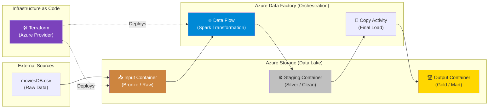

# 🎬 CineFlow: Enterprise Cloud-Native ETL Pipeline on Azure

<p align="center">
  
  
  
  
  
  
</p>

**CineFlow** è una pipeline ETL (Extract, Transform, Load) cloud-native end-to-end realizzata su Microsoft Azure. Il progetto dimostra come orchestrare l'ingestion, la trasformazione e la distribuzione di asset informativi complessi utilizzando il meglio del Modern Data Stack su Azure, con un focus rigoroso sulla riproducibilità tramite Infrastructure as Code (IaC).

L'intera infrastruttura è automatizzata e gestita come codice, garantendo ambienti consistenti e scalabilità enterprise.

## 🏢 Valore Enterprise & Settori di Applicazione

| Settore / Ambito | Rilevanza & Benefici |
|-------------------|-----------|
| **Modern Cloud Migration** | Implementazione di pattern "Cloud-Native" per la migrazione di processi legacy verso Azure Data Factory. |
| **Data Governance & IaC** | Gestione centralizzata dell'infrastruttura tramite Terraform, abilitando audit trail, versionamento delle risorse e disaster recovery rapido. |
| **Media & Entertainment Analytics** | Elaborazione di dataset voluminosi (es. cataloghi film, user ratings) con logiche di business complesse applicate tramite Spark. |
| **Enterprise Data Platforms** | Architettura multi-stage (Bronze/Silver/Gold) che garantisce la separazione tra dati grezzi immutabili e prodotti pronti per il consumo. |

---

## 🎯 Executive Summary & Valore di Business
CineFlow risolve il problema della gestione manuale e non scalabile dei dati cloud, offrendo un framework robusto per pipeline di produzione.

### 🏛️ 1. Architettura Medallion su Cloud
* **Separazione dei Layer (Three-Zone Storage):** Utilizzo di tre container Blob Storage distinti (`input`, `staging`, `output`) per isolare le fasi del dato. Questo garantisce che il dato grezzo rimanga immutabile (Landing Zone), mentre le trasformazioni avvengono in ambienti controllati.
* **Ispezione e Debugging:** L'area di staging permette ai Data Engineers di validare i risultati intermedi senza impattare la produzione finale.

### ⚙️ 2. Infrastructure as Code (IaC) con Terraform
* **Deploy Deterministico:** Resource Group, Storage Account, Linked Services e Pipeline ADF sono definiti interamente in Terraform. Questo elimina l' "human error" configurativo e permette di scalare su più ambienti (Dev/Test/Prod) in pochi minuti.
* **FinOps Ready:** La capacità di distruggere l'intera infrastruttura con un singolo comando (`terraform destroy`) permette test intensivi ottimizzando i costi cloud.

### 🛡️ 3. Trasformazione Scalabile con Apache Spark
* **ADF Data Flows:** Invece di semplici copie file, il progetto utilizza i Data Flows di ADF, che eseguono logiche di trasformazione (filtri, remap, data cleaning) su cluster Apache Spark gestiti. Questo garantisce che la pipeline possa gestire carichi di dati crescenti senza degrado delle performance.

### ⚡ 4. Best Practice di Ingegneria
* **Linked Services & Sicurezza:** Utilizzo di configurazioni parametrizzate per la connessione tra servizi, predisponendo l'architettura all'integrazione con Azure Key Vault per la gestione dei segreti.

---

## 🏗️ Architettura Tecnica


## 🛠️ Stack Tecnologico

| Layer | Tecnologia | Ruolo |
|:------|:-----------|:-----|
| ☁️ **Cloud** | Microsoft Azure | Infrastructure & Platform |
| 🏗️ **Infrastructure** | Terraform | Infrastructure as Code (IaC) |
| ⚙️ **Orchestration** | Azure Data Factory | ETL Workflow Management |
| 📦 **Storage** | Azure Blob Storage | Data Lake (Bronze/Silver/Gold) |
| 🔥 **Processing** | ADF Data Flow (Spark) | Distributed Data Transformation |
| 💻 **CLI** | Azure CLI / Terraform CLI | Deployment & Management |

## 🚀 Setup e Deploy

### Prerequisiti
- Account Azure attivo con sottoscrizione valida.
- Azure CLI installata e configurata.
- Terraform ≥ 1.0.

### Procedura di Deployment

1. **Clone del repository:**
   ```bash
   git clone https://github.com/sylver86/02-azure-data-pipeline-terraform-adf.git
   cd 02-azure-data-pipeline-terraform-adf
   ```

2. **Login su Azure:**
   ```bash
   az login
   ```

3. **Inizializzazione e Apply di Terraform:**
   ```bash
   cd terraform
   terraform init
   terraform plan
   terraform apply
   ```

4. **Operatività Pipeline:**
   - Caricare il file `moviesDB.csv` (presente in `data_raw/`) nel container `input`.
   - Accedere ad Azure Data Factory Studio e avviare il trigger della pipeline.
   - Verificare l'output finale nel container `output`.

### Pulizia Risorse
Per evitare costi imprevisti, distruggere l'infrastruttura al termine dei test:
```bash
terraform destroy
```

<br><br>

*Progettato e sviluppato da Eugenio Pasqua.*

---

# 🇬🇧 ENGLISH VERSION

# 🎬 CineFlow: Enterprise Cloud-Native ETL Pipeline on Azure

<p align="center">
  
  
  
  
</p>

**CineFlow** is an end-to-end cloud-native ETL (Extract, Transform, Load) pipeline built on Microsoft Azure. The project demonstrates how to orchestrate the ingestion, transformation, and distribution of complex information assets using the best of the Modern Data Stack on Azure, with a rigorous focus on reproducibility via Infrastructure as Code (IaC).

## 🏢 Enterprise Value & Application Sectors

| Sector / Domain | Relevance & Benefits |
|-------------------|-----------|
| **Modern Cloud Migration** | Implementation of "Cloud-Native" patterns for migrating legacy processes to Azure Data Factory. |
| **Data Governance & IaC** | Centralized infrastructure management via Terraform, enabling audit trails, resource versioning, and rapid disaster recovery. |
| **Media & Entertainment Analytics** | Processing of voluminous datasets (e.g., movie catalogs, user ratings) with complex business logic applied via Spark. |
| **Enterprise Data Platforms** | Multi-stage architecture (Bronze/Silver/Gold) ensuring separation between immutable raw data and consumption-ready products. |

---

## 🎯 Executive Summary & Business Value
CineFlow addresses the challenge of manual and non-scalable cloud data management by providing a robust framework for production pipelines.

### 🏛️ 1. Medallion Architecture on Cloud
* **Zone Separation (Three-Zone Storage):** Uses three distinct Blob Storage containers (`input`, `staging`, `output`) to isolate data phases. This ensures raw data remains immutable (Landing Zone), while transformations occur in controlled environments.
* **Inspection & Debugging:** The staging area allows Data Engineers to validate intermediate results without impacting final production.

### ⚙️ 2. Infrastructure as Code (IaC) with Terraform
* **Deterministic Deployment:** Resource Groups, Storage Accounts, Linked Services, and ADF Pipelines are defined entirely in Terraform. This eliminates configuration "human error" and allows scaling across multiple environments (Dev/Test/Prod) in minutes.
* **FinOps Ready:** The ability to tear down the entire infrastructure with a single command (`terraform destroy`) enables intensive testing while optimizing cloud costs.

### 🛡️ 3. Scalable Transformation with Apache Spark
* **ADF Data Flows:** Instead of simple file copies, the project leverages ADF Data Flows, which execute transformation logic (filtering, remapping, data cleaning) on managed Apache Spark clusters. This ensures the pipeline can handle increasing data loads without performance degradation.

---

## 🏗️ Technical Architecture



## 🧰 Technology Stack

`Microsoft Azure` · `Azure Data Factory` · `Azure Blob Storage` · `Terraform ≥ 1.0` · `Apache Spark` · `Azure CLI`

## 🚀 Getting Started

1. **Clone the repo.**
2. **Azure Login:** `az login`.
3. **Deploy:** `cd terraform && terraform init && terraform apply`.
4. **Run:** Upload `moviesDB.csv` to `input` and trigger the pipeline.
5. **Cleanup:** `terraform destroy`.

<br><br>

*Designed and developed by Eugenio Pasqua.*
